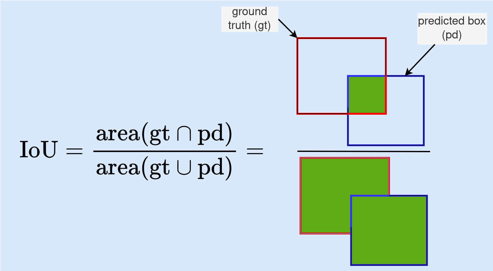
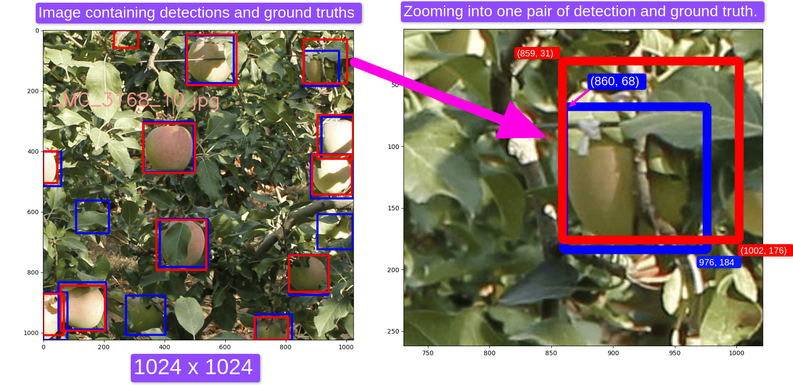
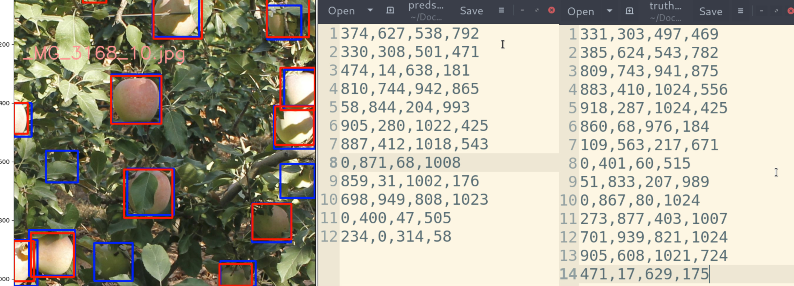
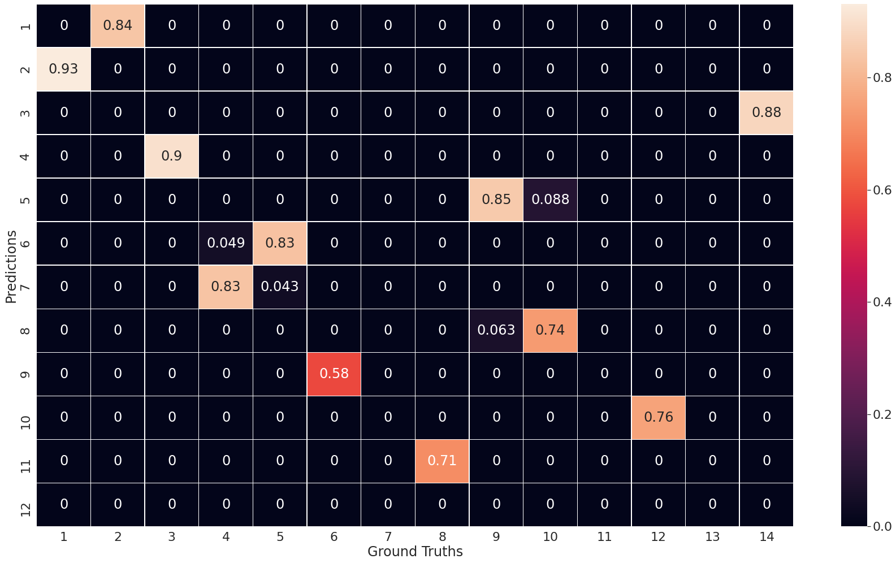
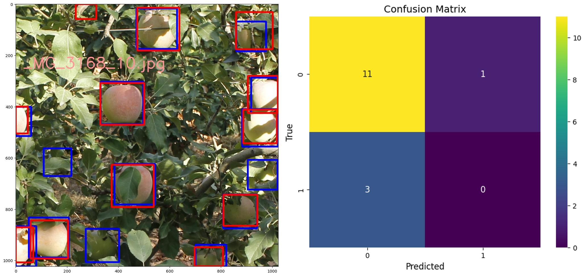

# Object Detection Model Evaluation
This repo contains code for evaluating single or multi-class object detection problems.

Specifically, this repo does two things:
- Implements Intersection over Union (IoU) metric (you can read more on [this blog post](https://medium.com/towards-data-science/understanding-intersection-over-union-for-object-detection-code-9a691c72d83a)),
- Implements a complete evaluation of an object detection model using detection examples from Mask R-CNN (you can read more on [link 1](https://medium.com/towards-data-science/confusion-matrix-and-object-detection-f0cbcb634157) or [link 2](https://medium.com/towards-data-science/on-object-detection-metrics-with-worked-example-216f173ed31e))

Next, let's see the structure of the repo and how to use it.

## Structure of the Repository
- [compute_iou2.py](compute_iou2.py) - Python script for computing IoU for single or multiple pairs of ground truths and detections.
- [evaluation.py](evaluation.py) - This Python script contains all the functions and classes needed to evaluate a detection model. The evaluation tool classifies detections and labels as TP, FP, or FN (you can read more about these metrics [here](https://medium.com/towards-data-science/confusion-matrix-and-object-detection-f0cbcb634157)).
- [examples](examples) - A folder containing images, detections, and ground truths that you can use as examples to test the evaluation tool. The predictions were generated by [Mask R-CNN](https://github.com/matterport/Mask_RCNN), and annotations of true labels were done using [VGG annotator](https://www.robots.ox.ac.uk/~vgg/software/via/via.html).
- [run_evaluation2.py](run_evaluation2.py) is a script for running the evaluation tool on the given example images. It calls the class `evaluation.py`.
- [output](output) - This folder contains output images generated when the evaluation tool is executed.
- [assets](assets) - Folder containing images used in this READMe. 


## How to Use the Repo

### Computing IoU

IoU is a core metric that measures the accuracy of the object detector by evaluating the degree of overlap between the detection box and the ground truth box.

IoU calculation is implemented in [compute_iou2.py](compute_iou2.py). Note that you can pass single or multiple pairs of detections and ground truth boxes to the script.

*Key point*: All detection and ground truth boxes should be defined by top-left coordinates (x1, y1) and bottom-right coordinates (x2, y2). Therefore, a box must be defined with `[x1, y1, x2, y2]`.

<p align="center">
  
</p>

#### Computing IoU for a single pair of detection

When passing a single pair, like the one shown in this Figure (Right), you need to configure the input as shown below.

```python
# Calling compute_iou function inside compute_iou2.ipy
# Make sure that the input is a Numpy array of [M, 4] shape
# detections and [N, 4] for labels. Since we have one pair, it will be [1,4] for both
detection = np.array([[859, 31, 1002, 176]])
label = np.array([[860, 68, 976, 184]])
iou_value = compute_iou(detection, label)
```



Expected IoU: 0.5783

#### Computing IoU for Multiple Pairs
If you want to compute IoUs for all pairs of detections and labels in an image, configure your input as shown below.

_red are predictions, and blue are labels_



```python
# Define detections and ground_truths
detections = np.array([[374,627,538,792],
        [330,308,501,471],
        [474,14,638,181],
        [810,744,942,865],
        [58,844,204,993],
        [905,280,1022,425],
        [887,412,1018,543],
        [0,871,68,1008],
        [859,31,1002,176],
        [698,949,808,1023],
        [0,400,47,505],
        [234,0,314,58]])

labels = np.array([[331,303,497,469],
        [385,624,543,782],
        [809,743,941,875],
        [883,410,1024,556],
        [918,287,1024,425],
        [860,68,976,184],
        [109,563,217,671],
        [0,401,60,515],
        [51,833,207,989],
        [0,867,80,1024],
        [273,877,403,1007],
        [701,939,821,1024],
        [905,608,1021,724],
        [471,17,629,175]])
# Call compute_iou() function 
ious = compute_iou(detections, labels)
```
In the example above, there are 14 detections and 12 ground truths.

Expected output (formatted for better viewing):



From the output, note the following:
- One detection (Index 12) did not overlap any ground truth.
- 3 ground truths with no overlap with any detection — ground truths at indices 7, 11, and 13.
- There are 11 detections with IoU>50% with ground truths.

### Detection Model Evaluation Tool
Complete evaluation of the detection model is done in [evaluation.py](evaluation.py) script. This script contains a Python class and functions that accept 5 arguments in total:
- `num_classes` (default: 1) - This is an interger representing the number of classes in your object detection problem,
- `confidence_threshold` (default: 0.3) - This is the threshold for confidence scores. Any detection with confidence lower than the threshold is ignored when conducting evaluation,
- `iou_threshold` (default: 0.5) - This is a threshold for determining a valid detection based on IoU. If the IoU of detection and ground truth is greater than the threshold, the detection is regarded as True Positive. If the IoU is less than the threshold, the detection will be referred to as a False Positive, and the ground truth will be classified as False Negative. Ground truths that the detection models missed are also classified as False Negatives.
- `detections` - these are the predicted boxes of your model. A detection box must be defined with 6 values: `x1,y1,x2,y2, confidence,class_id` where `(x1, y1)` is the top-left coordinates of the predicted box, `(x2, y2)` is the bottom-right coordinates, `confidence`` is the confidence score, and `class_id` is the predicted class (_note: you must pass the information in the given order_).

    **Important note on class_id**: For an _m_-class detection problem, class_id must come from the set {0,1,...,m}

    For example, if you have a 1-class problem (e.g., detecting fruits), then class_id must be 0 for all detections made, and num_classes=1

    If you have a 3-class problem (e.g., detecting fruit as an apple, mango, or orange), then class_id must come from set {0, 1, 2}, and num_classes=3

    *The first class must be assigned the class_id 0*.

-  `labels` - these are the ground truth boxes. A label box must have 5 pieces of information: `x1, y1, x2, y2, class_id` where `(x1, y1)` is the top-left coordinates of the ground-truth, `(x2, y2)` is the bottom-right coordinates, `class_id` is the true class of the object (_note: you must pass the information in the given order_).

Here is an example of how to configure input into the evaluation tool and the expected output.

```python

# Run the Evaluation Tools on multiple detection-labels pairs
# Initialize the ConfusionMatrix class by passing num_classes, confidence_threshold, and  iou_threshold
confusion_matrix = ConfusionMatrix(num_classes=1, confidence_threshold=0.8, iou_threshold=0.5)

detections = np.array([[374,627,538,792,0.9996,0],
        [330,308,501,471,0.9994,0],
        [474,14,638,181,0.9992,0],
        [810,744,942,865,0.9966,0],
        [58,844,204,993,0.9965,0],
        [905,280,1022,425,0.9881,0],
        [887,412,1018,543,0.9811,0],
        [0,871,68,1008,0.9759,0],
        [859,31,1002,176,0.973,0],
        [698,949,808,1023,0.9303,0],
        [0,400,47,505,0.9203,0],
        [234,0,314,58,0.8163,0]])

labels = np.array([[331,303,497,469, 0],
        [385,624,543,782, 0],
        [809,743,941,875, 0],
        [883,410,1024,556, 0],
        [918,287,1024,425, 0],
        [860,68,976,184, 0],
        [109,563,217,671, 0],
        [0,401,60,515, 0],
        [51,833,207,989, 0],
        [0,867,80,1024, 0],
        [273,877,403,1007, 0],
        [701,939,821,1024, 0],
        [905,608,1021,724, 0],
        [471,17,629,175, 0]])
# Process detections with process_detections() function inside the ConfusionMatrix class
matrix = confusion_matrix.process_detections(detections= detections, labels=labels)
# Plot confusion matrix
confusion_matrix.plot_matrix(fontsize=15)
# Output TPs, FPs, and FNs
result = confusion_matrix.compute_tp_fp_fn()
```

_In the Figure below, red boxes are detections, and blue boxes are ground-truths._




From the output, we can see that, 
- There are 11 True Positives, that is, fruits that were detected correctly,
- There are 3 False Negatives. These are fruits that were missed by the models or fruits whose IoU is less than the threshold,
- There is 1 False Positive. This is a case when the model wrongly detected a fruit.
 
# Requirements
Packages required to reproduce the results in this repo have been added to [requirements.txt](requirements.txt)

Just install the dependencies by running

```
pip3 install -r requirements.txt
```

and you should be ready to go.

# Useful References 

1. [Understanding Intersection Over Union for Object Detection (Code)](https://towardsdatascience.com/understanding-intersection-over-union-for-object-detection-code-9a691c72d83a)
2. [Confusion Matrix for Object Detection](https://medium.com/towards-data-science/confusion-matrix-and-object-detection-f0cbcb634157)
3. [Object Detection Metrics With Worked Example](https://medium.com/towards-data-science/on-object-detection-metrics-with-worked-example-216f173ed31e)