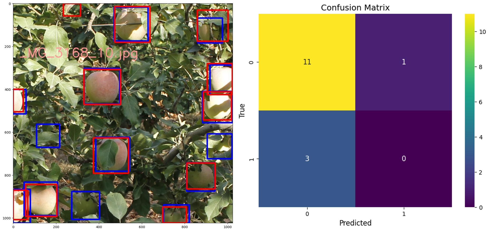

# Object Detection Model Evaluation
This repo contains code for evaluating multi-class object detection problem. 

Specifically, this repo does two things:
- Impelements Intersection over Union (IoU) metric,
- Impelements a complete evaluation of an object detection model using detection examples from Mask R-CNN

## Examples 

